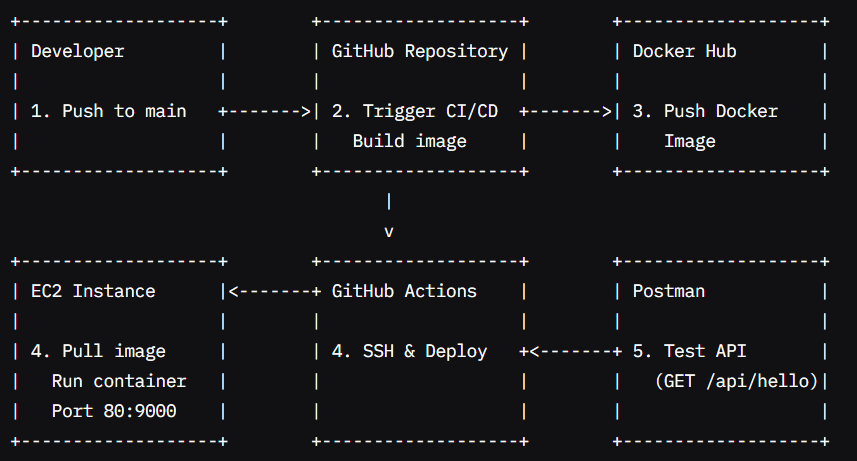
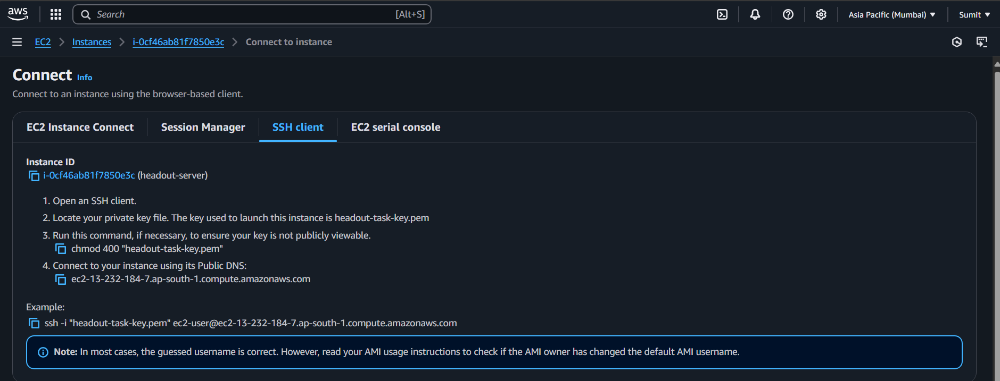
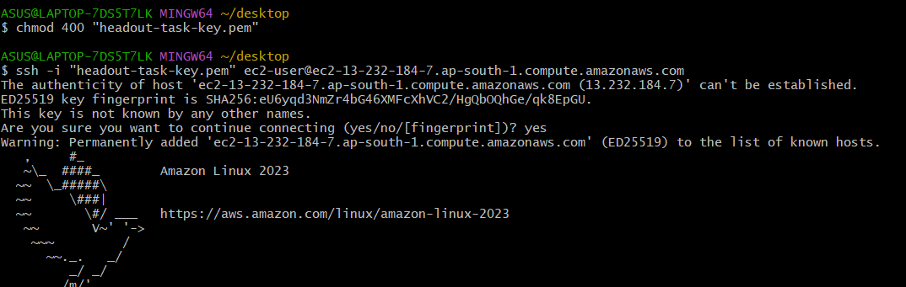
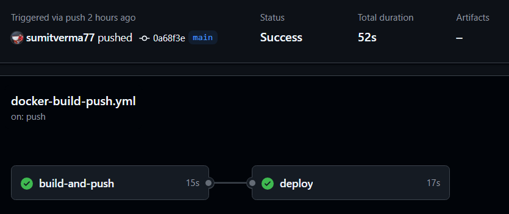
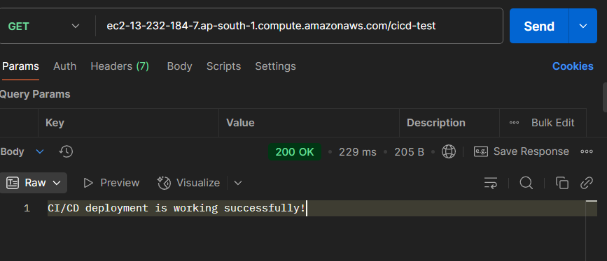

# 🚀 Cloud-Ready Spring Boot Application Deployment 
## Table of Contents

*   [Overview](#overview)
*   [Prerequisites](#prerequisites)
*  [Workflow](#workflow)
*  [Architecture Diagram](#architecture-diagram)
*   [Creating the Spring Boot Project](#creating-the-spring-boot-project)
*   [Adding Endpoints](#adding-endpoints)
*   [Pushing to GitHub](#pushing-to-github)
*   [Configuration](#configuration)
    *   [application.properties](#applicationproperties)
    *   [Dockerfile](#dockerfile)
*   [Deployment Steps](#deployment-steps)
*   [Deploy Docker Image on EC2 from the terminal](#deploy-docker-image-on-ec2-from-the-terminal)
*   [Accessing the Application](#accessing-the-application)
*   [Checking the Running Port](#checking-the-running-port)
*   [CI/CD Pipeline (GitHub Actions)](#cicd-pipeline-github-actions)
*  [GitHub Secrets](#github-secrets-)
*   [Push Code to GitHub to Trigger Workflow](#push-code-to-github-to-trigger-workflow)
*   [Testing](#testing)
 ## Must-Read Section (Critical Sections)
*  **[Assumptions Made During Implementation](#assumptions-made-during-implementation)** 
*  **[Challenges Faced & How I Solved Them](#challenges-faced--how-i-solved-them)**
*  **[Manual Work](#manual-work-)**
*  **[Remaining Work / Future Improvements](#remaining-work--future-improvements)**


## Overview

This repository contains a Spring Boot application that is Dockerized and deployed to an AWS EC2 instance using a GitHub Actions CI/CD pipeline. This README provides a detailed guide from creating the project to deploying it with CI/CD.

## Prerequisites

*   AWS Account
*   EC2 Instance
*   Docker Hub Account
*   GitHub Repository
*   Java Development Kit (JDK)
*   Maven
*   Basic knowledge of Spring Boot, Docker, and GitHub Actions

## Workflow

1. **Push to GitHub**: Developer pushes code changes to the main branch.
2. **GitHub Actions Trigger**: The workflow detects changes in src/, Dockerfile, or pom.xml.
3. **Build and Push**:
    - Checks out the code
    - Builds the Docker image using the Dockerfile.
    - Pushes the image to Docker Hub.
4. **Deploy to EC2**:
    - SSH into the EC2 instance.
    - Pulls the latest Docker image.
    - Stops/removes any existing container named app.
    - Frees port 80 if occupied.
    - Runs a new container with the updated image.
5. **Test with Postman**: Send requests to http://<EC2_PUBLIC_IP>/api/hello to verify the application.

## Architecture Diagram


## Creating the Spring Boot Project

1.  **Create a new Spring Boot project using Spring Initializr:**
    *   [Image of Spring Initializr configuration]
2.  **Add dependencies:**
    *   Spring Web
    *   Spring Boot DevTools

## Adding Endpoints

1.  **Create a controller class:**

    ```java
    @RestController
    public class AppController {

       
       @PostMapping("/echo")
       public ResponseEntity<Map<String, Object>> echo(@RequestBody Map<String, Object> input) {
        log.info("Received /echo request with body: {}", input);
        return ResponseEntity.ok(input);
       }

        @GetMapping("/status")
        public String status() {
            return "OK";
        }
    }
    ```

    This code creates a simple controller with two endpoints: `/echo` and `/status`.

## Pushing to GitHub

1.  **Create a new GitHub repository:**
2.  **Initialize a Git repository in the project directory:**

    ```bash
    git init
    ```

    This command initializes a new Git repository in the current directory.

3.  **Add the project files to the repository:**

    ```bash
    git add .
    ```

    This command adds all the files in the current directory to the staging area.

4.  **Commit the changes:**

    ```bash
    git commit -m "Initial commit"
    ```

    This command commits the changes with a message "Initial commit".

5.  **Push the repository to GitHub:**

    ```bash
    git remote add origin <repository_url>
    git push -u origin main
    ```

    *   `git remote add origin <repository_url>`: This command adds a remote repository named "origin" with the specified URL.
    *   `git push -u origin main`: This command pushes the local "main" branch to the remote "origin" repository and sets up tracking.

## Configuration

### application.properties

```properties
spring.application.name=cloud-ready-springboot
server.port=9000
server.address=0.0.0.0
```

This file configures the Spring Boot application.

### Dockerfile

```dockerfile
FROM eclipse-temurin:17-jre-alpine

WORKDIR /app

COPY target/*.jar app.jar

EXPOSE 9000

CMD ["java", "-jar", "app.jar"]
```

This file defines the steps to build the Docker image.

## Deployment Steps

1.  **Create an EC2 Instance:**
2.  **Install Docker on EC2:**
3.  **Configure Docker Hub Credentials:**

## Deploy Docker Image on EC2 from the terminal
1.  Open an SSH client (I have used `Bash` for Widnows).
2.  Locate your private key file. The key used to launch this instance is `headout-task-key.pem`.
3.  Run this command, if necessary, to ensure your key is not publicly viewable:

    ```bash
    chmod 400 "headout-task-key.pem"
    ```

4.  **Connect to the EC2 instance using SSH:**

    ```bash
    ssh -i "headout-task-key.pem" ec2-user@ec2-13-232-184-7.ap-south-1.compute.amazonaws.com
    ```

    Replace `ec2-user@ec2-13-232-184-7.ap-south-1.compute.amazonaws.com` with your EC2 instance's public IP address and Replace `eheadout-task-key.pem"` with your kay name.
5. For eg: 
6. ### Output: 

#### ✅ _Now we can access EC2 Instance from the terminal_.

#### 1. Install Docker on the EC2 Instance

To run Docker containers, you need to install Docker on your EC2 instance.

`sudo yum install docker`

This command installs Docker using the YUM package manager.

#### 2. Verify Docker Installation

Verify Docker is installed correctly by checking its version:

`docker --version`

The command will display the installed version (e.g., Docker version 20.10.17, build 100c701).

#### 3. Start and Enable the Docker Service

Start Docker and enable it to launch on system boot:

`sudo systemctl start docker
sudo systemctl enable docker`

Verify that Docker is running:

`sudo systemctl status docker`

#### 4. Pull the Spring Boot Docker Image

Download the Spring Boot application image from Docker Hub:

`sudo docker pull sumitverma77/cloud-ready-springboot`

#### 5. Verify the Docker Image

Confirm the image was downloaded successfully:

`sudo docker images`

Look for sumitverma77/cloud-ready in the list of images.

#### 6. Run the Spring Boot Application

Launch the application in a Docker container with port mapping:

`sudo docker run --rm -d -p 80:9000 sumitverma77/cloud-ready`

- --rm: Automatically removes the container when it stops
- -d: Runs the container in detached mode (background)
- -p 80:9000: Maps port 80 on the EC2 instance to port 9000 in the container

## Accessing the Application

Once the container is running, you can access the Spring Boot application by navigating to `http://[EC2_PUBLIC_IP] `in your web browser, where `[EC2_PUBLIC_IP]` is the public IP address of your EC2 instance.
  
## Checking the Running Port

1.  **Check if the application is running on port 80:**

    ```bash
    sudo netstat -tulnp | grep 80
    ```

    This command lists all the processes listening on port 80.

## CI/CD Pipeline (GitHub Actions)

The `.github/workflows/docker-build-push.yml` file defines the CI/CD pipeline.

```yaml
name: Build and Push Docker Image

on:
  push:
    branches: [ "main" ]

jobs:
  build-and-push:
    runs-on: ubuntu-latest

    steps:
      - name: Checkout code
        uses: actions/checkout@v4

      - name: Log in to Docker Hub
        uses: docker/login-action@v3
        with:
          username: ${{ secrets.DOCKER_USERNAME }}
          password: ${{ secrets.DOCKER_PASSWORD }}

      - name: Build and push Docker image
        uses: docker/build-push-action@v5
        with:
          context: .
          file: ./Dockerfile
          push: true
          tags: ${{ secrets.DOCKER_IMAGE_NAME }}:latest

  deploy:
    needs: build-and-push
    runs-on: ubuntu-latest

    steps:
      - name: Deploy to EC2 via SSH
        uses: appleboy/ssh-action@master
        with:
          host: ${{ secrets.EC2_HOST }}
          username: ec2-user
          key: ${{ secrets.EC2_SSH_KEY }}
          script: |
            echo "Pulling latest image..."
            sudo docker pull ${{ secrets.DOCKER_IMAGE_NAME }}:latest

            echo "Stopping old container (if any)..."
            sudo docker stop app || echo "No container named 'app' was running."

            echo "Removing old container (if any)..."
            sudo docker rm -f app || echo "No container named 'app' to remove."

            # Check and free port 80 if occupied
            PORT_OCCUPIED_CONTAINER=$(sudo docker ps --filter "publish=80" --format "{{.ID}}")
            if [ -n "$PORT_OCCUPIED_CONTAINER" ]; then
              echo "Port 80 is occupied by container $PORT_OCCUPIED_CONTAINER, stopping it..."
              sudo docker stop "$PORT_OCCUPIED_CONTAINER"
              sudo docker rm "$PORT_OCCUPIED_CONTAINER"
            fi

            sleep 2  # wait a bit to ensure cleanup

            echo "Running new container..."
            sudo docker run -d --name app -p 80:9000 ${{ secrets.DOCKER_IMAGE_NAME }}:latest

            echo "Current running containers:"
            sudo docker ps -a

            echo "Logs from new container (last 50 lines):"
            sudo docker logs --tail 50 app
```

This pipeline builds and pushes the Docker image to Docker Hub and then deploys it to the EC2 instance via SSH.

## GitHub Secrets 

Configure the following secrets in your GitHub repository:

* `DOCKER_USERNAME`: Your Docker Hub username.
* `DOCKER_PASSWORD`: Your Docker Hub access token or password.
* `DOCKER_IMAGE_NAME`: The Docker image name (e.g., sumitverma77/cloud-ready).
* `EC2_HOST`: The public IP or DNS of your EC2 instance.
* `EC2_SSH_KEY`: The private SSH key for the EC2 instance.

## Push Code to GitHub to Trigger Workflow
```
git add .
git commit -m "Trigger CI/CD pipeline"
git push origin main 
```

✅ This push to the main branch will automatically start your GitHub Actions workflow.


## Testing

To test the application, send requests to `http://<EC2_PUBLIC_IP>/api/hello` to verify the application.


## Assumptions Made During Implementation
* The .jar file is located at target/cloud-ready-springboot-0.0.1-SNAPSHOT.jar and is started using java -jar.
* The Docker container exposes port 9000, while the EC2 instance maps it to port 80 using -p 80:9000 to serve HTTP traffic on the default port.
* Docker and Java are not pre-installed on the EC2 instance, so the automation script installs them during setup.
* Only one Docker container is run at a time, and any older running containers are stopped to prevent port conflicts.
* The application is assumed to be stateless, so no persistent volumes or external database connections are required.
* The EC2 security group allows HTTP (port 80) and SSH (port 22) access.
* The deployment process involves stopping the existing container/instance before starting the new one (i.e., **no rolling deployment yet**).


## Challenges Faced & How I Solved Them
1. **Port 80 Conflict with Existing Containers**

When re-deploying, port 80 was sometimes already in use, preventing the new container from starting.

**Fix:** Used Docker command to detect if any container was using port 80, stopped and removed it before starting a new one.

2. **Container Name Conflict ("app" already exists)**

Re-running deployment failed because a container named app already existed.

**Fix:** Script forcibly stops and removes any container named app before launching a new one.

3. **Image Not Reflecting Latest Changes**

Occasionally, EC2 was running outdated image versions due to cached layers.

**Fix:** Explicitly pulled the latest image using docker pull as the first step in the SSH deploy script.

4. **No Logging or Debugging**

Without proper logging, it was hard to verify deployment success or diagnose issues.

**Fix:** Added `docker ps -a` and` docker logs --tail 50` at the end to inspect running containers and recent logs.

## Manual Work  
1. **Created EC2 Instance:**
Launched a new EC2 instance with appropriate instance type and AMI.

2. **Configured Security Groups:**
Opened inbound ports 22 (SSH) and 80 (HTTP) to allow SSH access and web traffic.

3. **Connected to EC2 via SSH:**
Used the .pem key with proper permissions (chmod 400) to securely connect.

4. **Installed Java and Docker Manually:**
Since the EC2 instance didn’t have Java or Docker pre-installed, installed them manually using package managers.

## Remaining Work / Future Improvements
1. Attach a Load Balancer and Integrate SSL Certificate:
To improve availability and security, plan to attach an Elastic Load Balancer (ELB) in front of the EC2 instance and configure an SSL certificate for HTTPS access.
2. Implement Rolling Deployments:
   Currently, when deploying new versions, the old container or instance is stopped before the new one starts, causing downtime. Rolling deployment would allow updating the application gradually by replacing instances or containers one at a time without stopping the entire service — ensuring zero downtime and continuous availability during updates.